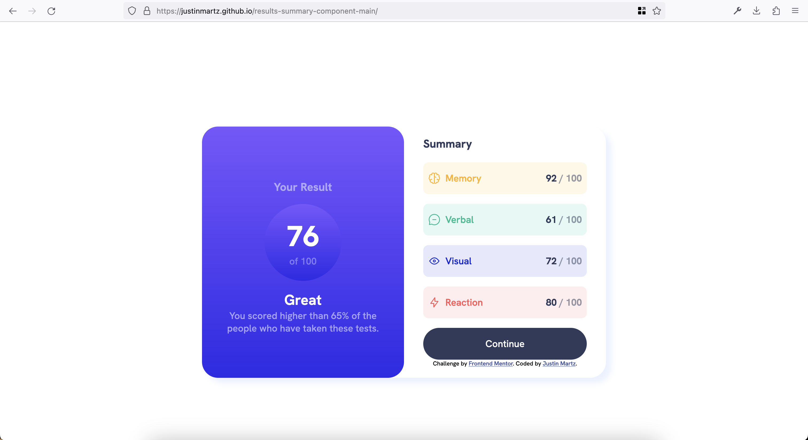
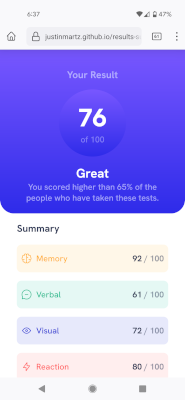

# Frontend Mentor - Results summary component solution

This is a solution to the [Results summary component challenge on Frontend Mentor](https://www.frontendmentor.io/challenges/results-summary-component-CE_K6s0maV). Frontend Mentor challenges help you improve your coding skills by building realistic projects. 

## Table of contents

- [Overview](#overview)
  - [The challenge](#the-challenge)
  - [Screenshot](#screenshot)
  - [Links](#links)
- [My process](#my-process)
  - [Built with](#built-with)
  - [What I learned](#what-i-learned)
  - [Continued development](#continued-development)
  - [Useful resources](#useful-resources)
- [Author](#author)

## Overview

### The challenge

Users should be able to:

- View the optimal layout for the interface depending on their device's screen size
- See hover and focus states for all interactive elements on the page

### Screenshot




### Links

- Solution URL: [GitHub repository](https://github.com/JustinMartz/results-summary-component-main)
- Live Site URL: [Live site](https://justinmartz.github.io/results-summary-component-main/)

## My process

### Built with

- JavaScript
- Semantic HTML5 markup
- CSS custom properties
- Flexbox
- Mobile-first workflow

### What I learned

I learned how to use git submodules so I could host each challenge in its own directory on GitHub Pages.

I wanted to use the provided data.json file to populate summary results, so I had to figure out some JS. This was also my first time writing any meaningful JavaScript. I had to scour StackOverflow to find examples of what I was looking for and then cobble together a solution that worked for this challange. Here's a rundown of the code:

Initialize variables. The data will get set dynamically as HTML in a div with the id=summaries.

```js
const summariesContainer = document.getElementById('summaries');
const list = document.createDocumentFragment(); 
```

Get the JSON data from data.json and put it into a variable called summaries. I probably should rename this summariesData to avoid confusion with the reference to the div.

```js
fetch("data.json")
      .then(response => response.json())
      .then(data => {
        console.log(data)
        let summaries = data;
```
Set up a for loop to iterate four times (since there are four JSON entries). Each loop creates the necessary HTML elements that will be used to display and style the data. These are stored in respective variables.

```js
for(var i = 0; i < 4; i++) {
          let div = document.createElement("div");
          let category = document.createElement('p');
          let score = document.createElement('span');
          let icon = document.createElement('img');
          let hundred = document.createElement('p');
```
Still in the loop, add data to the corresponding HTML element.

```js
category.innerHTML = `${summaries[i].category}`;
          score.innerHTML = `${summaries[i].score}`;
          hundred.innerHTML = "&nbsp;/ 100";
          icon.src = `${summaries[i].icon}`;
```
Still in the loop, append each completed HTML element to the document fragment const list.

```js
div.appendChild(icon);
          div.appendChild(category);
          div.appendChild(score);
          div.appendChild(hundred);
          list.appendChild(div);

          summariesContainer.appendChild(list);
        }
      }) 
```
This was my first time using hsla() for colors and opacity. I like it.
```css
color: hsla(241, 100%, 89%, .75);
```

### Continued development

I'll continue learning more about CSS and responsive design. I'll also continue to learn about JavaScript and building more dynamic websites.

### Useful resources

- [JSON Placeholder](https://jsonplaceholder.typicode.com) - Dummy JSON data on a live server to help test things that use JSON data.
- [How to Use the JavaScript Fetch API To Get Data](https://www.digitalocean.com/community/tutorials/how-to-use-the-javascript-fetch-api-to-get-data) - This tutorial helped me to understand how to get data from a JSON file in the first place.

## Author

- Website - [Justin Martz on GitHub Pages](https://justinmartz.github.io)
- Frontend Mentor - [@JustinMartz](https://www.frontendmentor.io/profile/JustinMartz)
